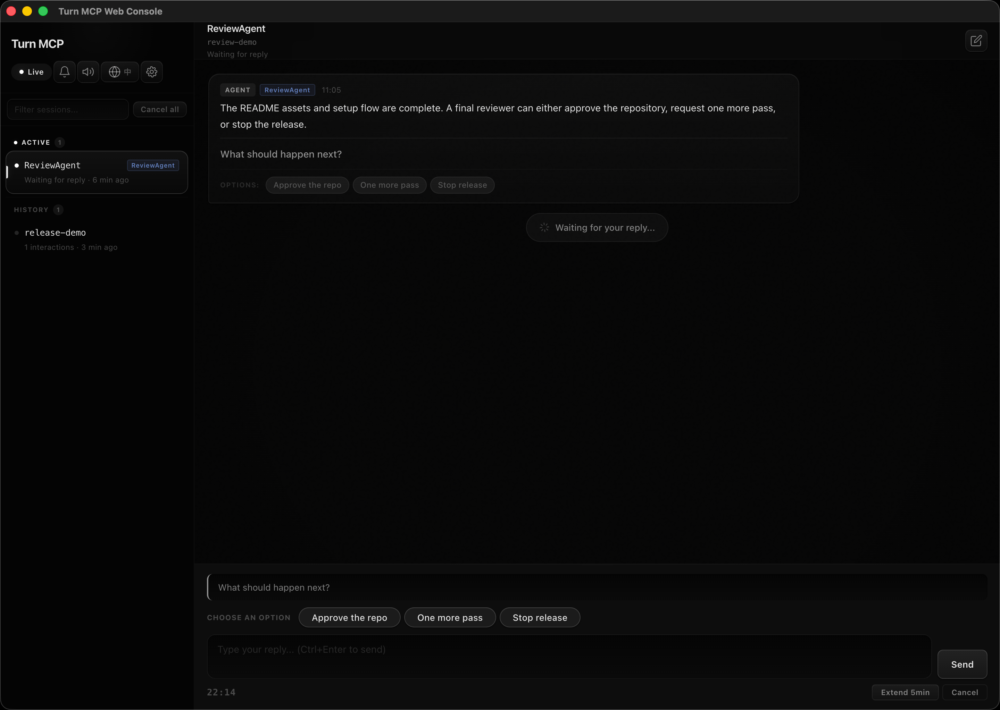
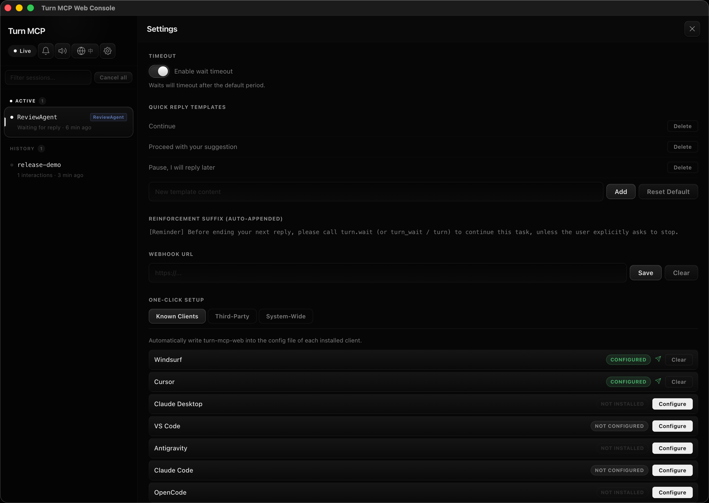
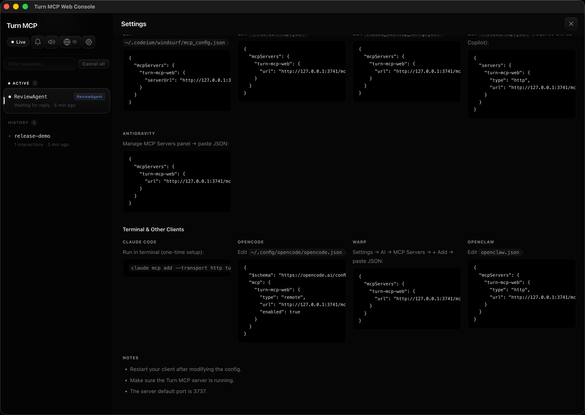
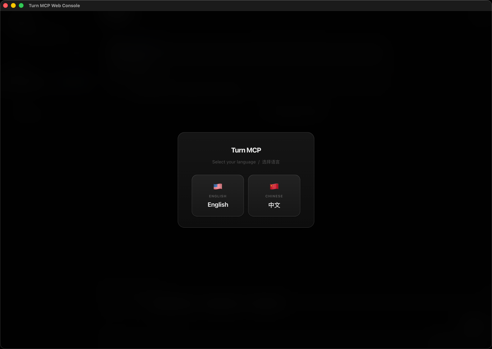

# turn-mcp-web

Turn a single agent request into a durable human-in-the-loop conversation.

`turn-mcp-web` is a self-hosted MCP server with a browser console. An agent calls `turn.wait`, execution pauses, a human replies in the web UI, and the same run continues without starting over.

[](LICENSE)
[](https://nodejs.org)

[中文文档](./README.zh-CN.md)

## Preview

<p align="center">
  
</p>

<p align="center">
  
  
  
</p>

Video file in this repository: [`assets/demo/turn-mcp-demo.mov`](./assets/demo/turn-mcp-demo.mov)

## Why It Exists

Most agent integrations treat a human checkpoint as a dead end:

- the model asks a question
- the run stops
- the next message starts a new run with partial context

`turn-mcp-web` keeps that checkpoint inside the same execution loop.

```text
work -> turn.wait -> human reply -> work -> turn.wait -> human reply
```

That makes it useful for approvals, branching decisions, operator handoffs, review queues, and long-running assisted workflows.

## What You Get

- MCP tool aliases: `turn.wait`, `turn_wait`, `turn`
- browser console for live replies
- Streamable HTTP transport for IDE MCP clients
- stdio entrypoint for desktop clients that spawn MCP servers
- REST long-poll API for Python and non-MCP agent frameworks
- persistent history and event logging
- webhook and Telegram notifications
- operator and viewer API roles
- session list, quick replies, timeout controls, and live SSE updates
- one-command local startup

## Quick Start

### macOS

Double-click `start.command`

### Windows

Double-click `start.bat`

### Linux

```bash
bash start.sh
```

### From Source

```bash
npm install
npm run build
npm start
```

Web console: `http://127.0.0.1:3737/`  
MCP endpoint: `http://127.0.0.1:3737/mcp`

## Core Workflow

1. Start the server.
2. Connect your MCP client to `http://127.0.0.1:3737/mcp` or launch the stdio entrypoint.
3. Give the agent [`SKILL.md`](./SKILL.md) so it routes user-facing checkpoints through `turn.wait`.
4. When the agent pauses, answer in the browser console.
5. The same agent run resumes with your reply.

## Client Setup

### Streamable HTTP

Use this for Cursor, Windsurf, VS Code, Claude Code, Antigravity, and other MCP clients that support remote HTTP servers.

```json
{
  "mcpServers": {
    "turn-mcp-web": {
      "url": "http://127.0.0.1:3737/mcp"
    }
  }
}
```

Windsurf uses `serverUrl` instead of `url`.

### stdio

Use this when the client launches MCP servers as local child processes.

```json
{
  "mcpServers": {
    "turn-mcp-web": {
      "command": "node",
      "args": ["/absolute/path/to/dist/server-stdio.js"]
    }
  }
}
```

The stdio process still opens the same web console on port `3737`.

### Python

Use the bundled Python client when your framework does not speak MCP directly.

```bash
pip install ./python-client
```

```python
from turn_mcp_client import TurnMcpClient, TurnMcpCanceled, TurnMcpTimeout

client = TurnMcpClient("http://127.0.0.1:3737")

try:
    reply = client.wait(
        context="About to apply a production migration.",
        question="Should I proceed?",
        options=["Proceed", "Show SQL", "Cancel"],
        agent_name="MigrationAgent",
    )
    print(reply)
except TurnMcpTimeout:
    print("No reply before timeout.")
except TurnMcpCanceled:
    print("Canceled by operator.")
```

More examples: [`python-client/README.md`](./python-client/README.md)

## Agent Contract

Give the agent one of these files:

- English: [`SKILL.md`](./SKILL.md)
- 中文: [`SKILL.zh-CN.md`](./SKILL.zh-CN.md)

Those files tell the agent to use `turn.wait` as the communication boundary instead of replying directly.

## API

### Public

- `GET /healthz`
- `GET /api/public-config`

### Session and wait control

- `GET /api/waits`
- `GET /api/waits/:id`
- `POST /api/waits/:id/respond`
- `POST /api/waits/:id/cancel`
- `POST /api/waits/:id/extend`
- `POST /api/waits/cancel-all`
- `POST /api/waits/create-and-wait`

### History and events

- `GET /api/history`
- `GET /api/history/timeline`
- `GET /api/events`
- `GET /api/stream`

### Runtime management

- `GET /api/auth-check`
- `GET /api/sessions`
- `POST /api/settings`
- `POST /api/auto-configure`
- `POST /api/auto-unconfigure`

## Environment

| Variable | Default | Purpose |
|---|---|---|
| `TURN_MCP_HTTP_HOST` | `127.0.0.1` | HTTP bind host |
| `TURN_MCP_HTTP_PORT` | `3737` | HTTP bind port |
| `TURN_MCP_HTTP_PATH` | `/mcp` | MCP endpoint path |
| `TURN_MCP_DEFAULT_TIMEOUT_SECONDS` | `600` | Default wait timeout |
| `TURN_MCP_API_KEY` | unset | Operator key |
| `TURN_MCP_VIEWER_API_KEY` | unset | Viewer key |
| `TURN_MCP_REQUIRE_API_KEY` | auto | Enable auth |
| `TURN_MCP_EVENT_LOG_FILE` | unset | JSONL event log path |
| `TURN_MCP_HISTORY_FILE` | unset | JSONL history path |
| `TURN_MCP_WEBHOOK_URL` | unset | Outbound webhook target |
| `TURN_MCP_WEBHOOK_EVENTS` | unset | Comma-separated webhook events |
| `TURN_MCP_WEBHOOK_SECRET` | unset | HMAC signing secret |
| `TURN_MCP_WEBHOOK_FORMAT` | `json` | `json`, `slack`, or `discord` |
| `TURN_MCP_TELEGRAM_BOT_TOKEN` | unset | Telegram bot token |
| `TURN_MCP_TELEGRAM_CHAT_ID` | unset | Telegram target chat |
| `TURN_MCP_TELEGRAM_EVENTS` | `wait_created` | Telegram event filter |
| `TURN_MCP_RATE_LIMIT_MAX` | `120` | Requests per IP |
| `TURN_MCP_RATE_LIMIT_WINDOW_SECONDS` | `60` | Rate limit window |
| `TURN_MCP_MAX_CONCURRENT_WAITS_PER_SESSION` | `10` | Per-session concurrency cap |
| `TURN_MCP_REINFORCEMENT_SUFFIX` | built-in | Appended reminder text |

## Authentication

Auth is off by default. When enabled, send either of these headers:

```text
x-turn-mcp-api-key: <key>
Authorization: Bearer <key>
```

Roles:

- `operator`: full control
- `viewer`: read-only inspection and SSE subscription

## Docker

```bash
docker build -t turn-mcp-web .
docker run --rm -p 3737:3737 \
  -e TURN_MCP_HTTP_HOST=0.0.0.0 \
  -e TURN_MCP_API_KEY=your_key \
  turn-mcp-web
```

Compose file: [`docker-compose.yml`](./docker-compose.yml)

## Repository Layout

```text
src/            TypeScript server
public/         Browser console
python-client/  Python client package
assets/         README screenshots and demo video
```

## Contributing

See [`CONTRIBUTING.md`](./CONTRIBUTING.md).

## License

MIT
